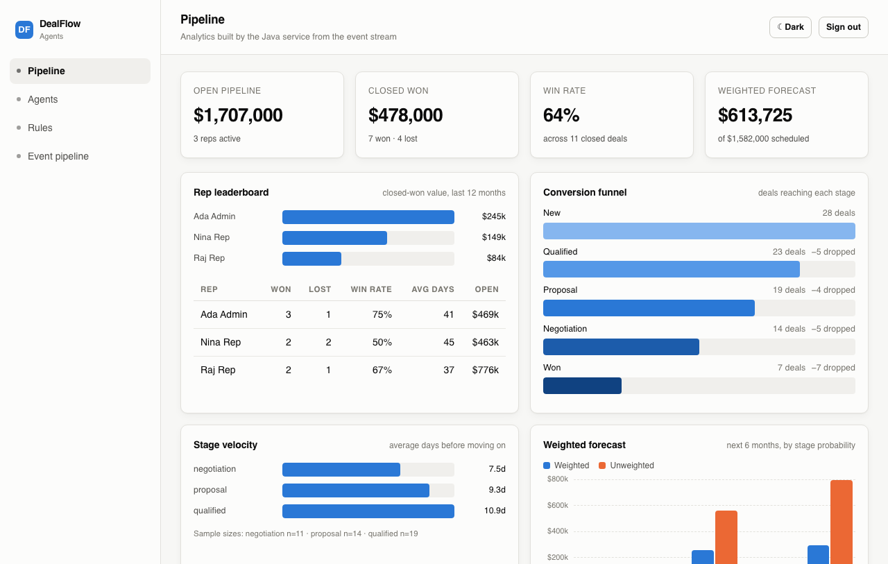
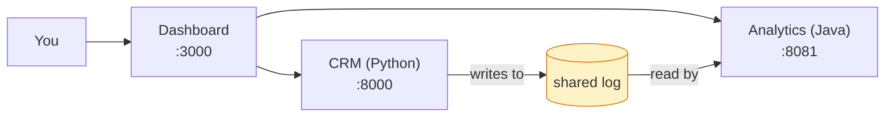
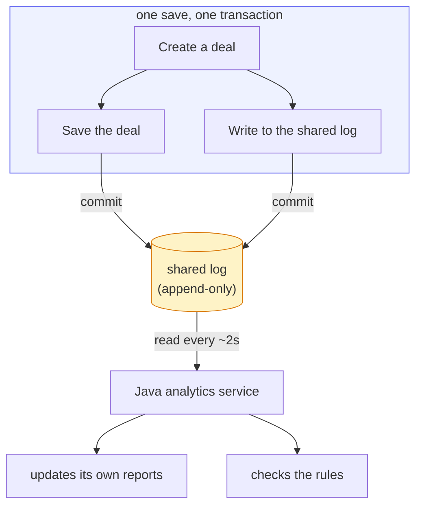
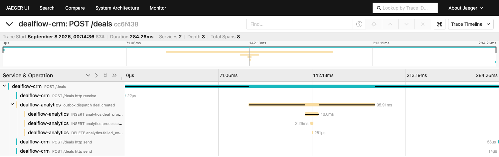

# DealFlow Agents

[](https://github.com/sssahoo-lang/dealflow-agents/actions/workflows/ci.yml)
&nbsp;257 automated tests run on every change — no API key or account needed to run them.



**Try it in one command:**

```bash
git clone https://github.com/sssahoo-lang/dealflow-agents.git
cd dealflow-agents
docker compose up -d --build
docker compose exec -T api python scripts/seed.py
```

Then open **http://localhost:3000**. No API key, no account to create — the
login screen has demo accounts you can sign in with in one click. See
[Setup](#setup) below for more detail, including a non-Docker path. Nothing
here is deployed anywhere; everything runs on your own machine.

## What is this?

DealFlow Agents is a small sales CRM (a tool for tracking companies,
contacts, and deals moving through a sales pipeline) with a few AI
assistants built in — one that scores new leads, one that drafts follow-up
emails, and one you can ask plain-English questions like "which of my deals
are worth the most?"

Alongside it is a **second, separate service**, written in a different
programming language, that only does reporting and analytics — a leaderboard,
a conversion funnel, a forecast, and a rules engine that flags deals going
cold.

The interesting part isn't really the CRM or the AI features — it's how those
two services talk to each other. They don't call each other's APIs directly.
Instead, the CRM writes down everything that happens (a company added, a
deal moved to a new stage) as a durable, ordered log, and the analytics
service reads that log on its own schedule and builds its own copy of the
data from it. This pattern — called a **transactional outbox** — is a common
one in real production systems, and getting it right (so that nothing is ever
lost, double-counted, or read out of order) is most of what this project is
actually about.



## What it does

**A basic CRM** — companies, contacts, deals, and a sales pipeline, with
logins and two roles: a rep only sees their own deals, an admin sees
everyone's. Anyone can move a deal forward, but only an admin can mark one
won or lost.

**Three AI assistants**, each built a different way:

| Assistant | What triggers it | How it works |
|---|---|---|
| **Lead scoring** | Automatically, when a deal is created | A small decision graph that scores the deal and decides whether to flag it |
| **Follow-up drafting** | You click a button | Writes a draft follow-up email — it never gets sent automatically |
| **Ask a question** | You type a question | Looks up an answer using a fixed set of safe, read-only lookups — it never writes its own database queries |

**A separate reporting service, written in Java**, that:
- Shows a leaderboard of who's winning the most business
- Shows a funnel of how many deals make it from "new" to "won"
- Predicts future revenue, weighted by how likely each deal is to close
- Runs a rules engine that flags deals that have gone quiet

This service never talks to the CRM directly — it only ever reads the shared
log the CRM writes to, and it can't see or touch the CRM's own database
tables at all (enforced by the database itself, not just by convention — more
on that below).

**A dashboard** that shows both halves of the system side by side, including
a page that shows the shared log itself: how far behind the analytics service
is, and whether anything has failed to process.

## How it's built



Two things worth knowing:

- **Saving a deal and logging the event happen together, or not at all.**
  They're written in the same database transaction, so there's no way for
  one to happen without the other.
- **The Java service is never told about anything directly.** It just reads
  the log on a timer and catches up. If it's offline for an hour, it hasn't
  missed anything — it picks up exactly where it left off once it's back.

The CRM is **Python (FastAPI)**. The analytics service is **Java (Spring
Boot)**. The dashboard is **Next.js**. They're deliberately different
languages and different services, on purpose — a big part of what this
project demonstrates is a real boundary between two systems, not one
monolith with different folders.

For the reasoning behind specific choices — why the shared log has no
"status" column, why tokens are signed the way they are, why there are no
running counters in the analytics database — see
**[docs/design-decisions.md](docs/design-decisions.md)**.

### Following one deal all the way through

Because the CRM and the analytics service don't call each other directly,
most tracing tools can't automatically follow a single request across both
of them. This project wires that up by hand: creating a deal produces one
continuous trace that starts in the CRM and picks back up in the Java service
a couple of seconds later, once it's read the log.


*One deal, one trace, two services — visible at http://localhost:16686 once you run `docker compose up`.*

## Setup

```bash
python3 -m venv .venv && .venv/bin/pip install -r requirements.txt
cp .env.example .env          # works as-is, no API key needed
docker compose up -d db
.venv/bin/alembic upgrade head
.venv/bin/python scripts/seed.py
.venv/bin/uvicorn app.main:app --reload
```

The API's interactive docs are at http://localhost:8000/docs

### Or run everything in Docker

```bash
docker compose up -d --build     # database → migrations → CRM → analytics → dashboard
docker compose exec -T api python scripts/seed.py
docker compose exec -T api python scripts/seed_demo.py   # optional: adds ~6 months of sample history
```

Open **http://localhost:3000** and sign in with one of the demo accounts
(the login screen lists them, with a one-click fill). The CRM API is on
:8000, the analytics API on :8081, the trace viewer on :16686, and the
database on :5433. Everything runs on your own machine — nothing is
published anywhere.

Demo logins (password is `demo1234` for all of them):
`admin@demo.com` (sees everything), `rep@demo.com` and `rep2@demo.com`
(each sees only their own deals).

**If things don't come up cleanly on a machine that already had this running
before:** the database setup script only runs automatically on a brand-new,
empty database volume. If you've run this before and it's not working, run:

```bash
docker compose exec -T db psql -U crm -d crm < db/init/01-analytics-role.sql
```

### About the AI features

By default, the AI assistants don't call a real language model — they run on
a small set of deterministic, rule-based stand-ins (see `app/agents/stub.py`)
so the whole project runs immediately with no API key, no cost, and no
network calls. Everything *around* the AI still runs for real: the database
writes, the permission checks, the decision graphs. What's simulated is just
the actual language generation — the lead-scoring logic is a real weighted
formula, but the follow-up email's wording is templated rather than written
by a model.

To use a real model instead, set `LLM_PROVIDER=anthropic` and add an
`ANTHROPIC_API_KEY` in your `.env` file. If the model provider has a problem —
a bad key, a rate limit, a network blip — the two assistants you call directly
(follow-up drafting, ask-a-question) return a clear error instead of crashing;
lead scoring runs in the background with nothing to return an error *to*, so a
failure there is written to the server logs instead, and that deal simply
stays unscored rather than blocking anything else. There's also a small set of
tests (`tests/test_agents/test_live_anthropic.py`) that make one real call per
assistant to prove the wiring actually works — skipped unless you run them
with a real key:

```bash
ANTHROPIC_API_KEY=sk-ant-... .venv/bin/pytest tests/test_agents/test_live_anthropic.py -v
```

## Try it yourself

A quick tour, using `curl` against a running instance:

```bash
TOKEN=$(curl -s -X POST localhost:8000/auth/login -H 'Content-Type: application/json' \
  -d '{"email":"rep@demo.com","password":"demo1234"}' | jq -r .access_token)

# Permissions: a rep can see their deals, but not close one
curl -s localhost:8000/deals -H "Authorization: Bearer $TOKEN"
curl -s -X PATCH localhost:8000/deals/1 -H "Authorization: Bearer $TOKEN" \
  -H 'Content-Type: application/json' -d '{"stage":"won"}'      # rejected (403)

# Create a deal and watch the lead-scoring assistant pick it up
curl -s -X POST localhost:8000/deals -H "Authorization: Bearer $TOKEN" \
  -H 'Content-Type: application/json' \
  -d '{"name":"New opportunity","company_id":1,"value":75000}'
sleep 5
curl -s localhost:8000/deals/4 -H "Authorization: Bearer $TOKEN"   # now has a score

# Ask a plain-English question
curl -s -X POST localhost:8000/agents/query -H "Authorization: Bearer $TOKEN" \
  -H 'Content-Type: application/json' \
  -d '{"question":"Which of my deals are worth the most?"}'
```

**Watching the shared log directly.** A stage change gets logged; a plain
rename doesn't:

```bash
curl -s -X PATCH localhost:8000/deals/1 -H "Authorization: Bearer $TOKEN" \
  -H 'Content-Type: application/json' -d '{"stage":"negotiation"}'
curl -s -X PATCH localhost:8000/deals/1 -H "Authorization: Bearer $TOKEN" \
  -H 'Content-Type: application/json' -d '{"name":"Renamed"}'

docker compose exec -T db psql -U crm -d crm -c \
  "SELECT id, event_type, aggregate_id, payload->>'value' AS value
     FROM outbox_events ORDER BY id;"
```

**The analytics service, reading that same log:**

```bash
# wait a couple of seconds for it to catch up, then:
curl -s localhost:8081/analytics/leaderboard -H "Authorization: Bearer $TOKEN"
curl -s localhost:8081/admin/outbox/status -H "Authorization: Bearer $TOKEN"   # how far behind it is
```

**The rules engine.** Make a deal look like it's gone quiet, sweep for stale
deals, watch a finding appear — then log activity and watch it clear:

```bash
docker compose exec -T db psql -U crm -d crm -c \
  "UPDATE analytics.deal_projection
      SET stage='negotiation', last_activity_at = now() - interval '21 days'
    WHERE deal_id = 1;"

curl -s -X POST localhost:8081/rules/run -H "Authorization: Bearer $TOKEN"
curl -s "localhost:8081/rules/findings?status=open" -H "Authorization: Bearer $TOKEN"

docker compose exec -T db psql -U crm -d crm -c \
  "UPDATE analytics.deal_projection SET last_activity_at = now() WHERE deal_id = 1;"
curl -s -X POST localhost:8081/rules/run -H "Authorization: Bearer $TOKEN"   # finding clears
```

**Proof that re-reading the log twice gives the same result** (this matters
because it means the analytics database can always be safely rebuilt from
scratch):

```bash
curl -s localhost:8081/analytics/leaderboard -H "Authorization: Bearer $TOKEN" > /tmp/before.json
docker compose exec -T db psql -U crm -d crm -c \
  "TRUNCATE analytics.processed_event; UPDATE analytics.consumer_offset SET floor_event_id = 0;"
sleep 8   # the analytics service reprocesses everything from the start
curl -s localhost:8081/analytics/leaderboard -H "Authorization: Bearer $TOKEN" > /tmp/after.json
diff /tmp/before.json /tmp/after.json && echo "IDENTICAL"
```

### How far behind is the analytics service, really?

The dashboard shows a live number of seconds. To see it as an actual
measurement rather than a single live reading, there's a small benchmark
that seeds 10,000 events at once and times how long they take to fully
catch up:

| Metric | Value |
|---|---|
| Typical (p50) delay | 55.18s |
| Worst-case (p99) delay | 110.19s |
| Time to rebuild everything from scratch (10,000 events) | 111.53s |

Details and how to reproduce this in [docs/benchmarks.md](docs/benchmarks.md).

### Keeping the log from growing forever

The shared log only ever grows, so old entries eventually need to be cleared
out:

```bash
.venv/bin/python scripts/prune_outbox.py --dry-run
.venv/bin/python scripts/prune_outbox.py --older-than-days 30
```

The one rule that matters: never delete anything the analytics service
hasn't read yet — otherwise there's no way to recover that data later, since
the log is the only copy of it.

## Tests

```bash
.venv/bin/python -m pytest tests/ -q                       # 166 Python tests
docker compose --profile test run --rm analytics-test      # 91 Java tests
```

Both run without needing an API key or network access. That's also true in
CI (`.github/workflows/ci.yml`), which runs both suites on every push with no
secrets configured at all — possible because the AI assistants default to
their rule-based stand-ins, described above. Four more Python tests exist
(`test_live_anthropic.py`) that make one real call each to prove the real
model provider is wired up correctly — skipped here and in CI, and only run
by hand with a real API key, as shown above.

## Project layout

```
app/                          the CRM (Python / FastAPI)
  models/      database tables — User, Company, Contact, Deal, Activity, OutboxEvent
  api/         routes and request handling
  services/    business logic
  events/      builds and writes entries to the shared log
  agents/      the three AI assistants
  observability/  optional tracing setup
scripts/       one-off scripts: seeding demo data, cleanup, the benchmark
tests/         166 tests (+ 4 opt-in, needing a real API key)
contracts/     the shared log's data format, checked from both languages

analytics-service/           the reporting service (Java / Spring Boot)
  outbox/      reads the shared log
  analytics/   the reports (leaderboard, funnel, forecast) + their API
  rules/       the rules engine
  security/    verifies logins from the CRM

frontend/                    the dashboard (Next.js)
  components/  one file per dashboard tab
  lib/api.ts   talks to both services directly
```

## Known limitations

Listed here on purpose, rather than left for someone to discover:

- **Login tokens don't survive a restart** unless you set `JWT_PRIVATE_KEY`
  yourself. By default the CRM generates a new signing key every time it
  starts, which is what lets the whole project run with zero setup — the
  trade-off is that a restart signs everyone out. A real deployment would
  set this once and keep it fixed.
- **The lead-scoring assistant can occasionally miss a new deal** if the CRM
  crashes at exactly the wrong moment. Nothing is ever lost from the shared
  log, but the "notify the assistant right away" path is a lighter-weight,
  best-effort mechanism than the log itself.
- **The two services share one database server**, even though they can't see
  each other's tables. That's a reasonable trade for a project this size, but
  a larger production system would likely give them separate databases too.
- **Not included:** actually sending emails (the follow-up assistant only
  drafts them), multi-turn conversations with the assistants, and a hosted
  version of this you can visit online — everything here is meant to be run
  on your own machine.
